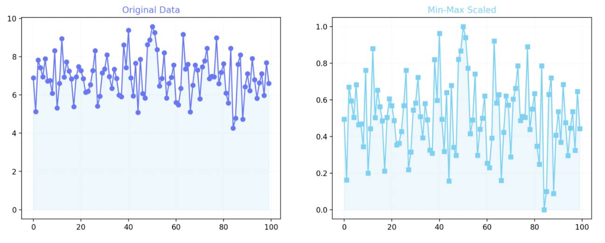
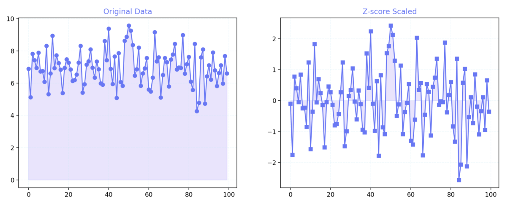
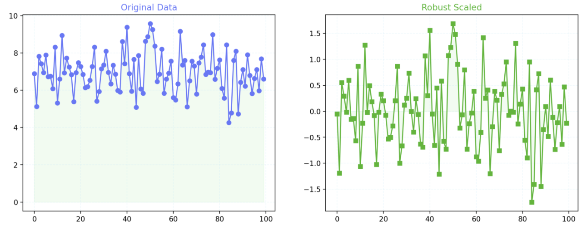

# Feature Scaling Visualizer Dashboard

This is a Streamlit-based web application that allows users to explore and compare different feature scaling techniques on their own datasets. It provides an intuitive layout where users can upload a CSV, choose a numeric column, and visualize how scaling affects the distribution of data using side-by-side plots.

## Features

- Upload any CSV file with one or more numeric columns.
- Select a column to scale and analyze.
- Choose from three scaling techniques:
  - **Min-Max Scaling**
  - **Z-Score Standardization**
  - **Robust Scaling**
- Compare the original data with the scaled data using:
  - Line plots (showing value transformations across rows).
  - Histograms (showing distribution changes).
- Modern dashboard-style layout: controls are on the left, visual output and analysis appear on the right.
- Styled explanation boxes for better understanding of scaling effects.

---

## How to Run the Application

1. **Clone the repository**

```bash
git clone https://github.com/yourusername/feature-scaling-dashboard.git
cd feature-scaling-dashboard
```

2. Install required dependencies
```bash
pip install -r requirements.txt
```

3. Run the Streamlit application

```bash
streamlit run layout_scaling_app.py
```

## Example CSV Input Format
 Ensure your dataset contains at least one numeric column. Example format:

ID,Age,Salary,Score
1,25,45000,82
2,35,60000,90
3,28,52000,75

## Transformation Methods Explained

# 1. Min-Max Scaling
Formula: x_scaled = (x - min(x)) / (max(x) - min(x))

What it does:
-Rescales data to a fixed range, typically [0, 1].
-Preserves the relationships between data points.
-Sensitive to outliers.

Use when:
You need normalized values (e.g., for neural networks or distance-based algorithms like KNN).

# 2. Z-Score Standardization (Standard Scaling)
Formula: x_standardized = (x - mean(x)) / std(x)

What it does:
-Centers the data around 0 with a standard deviation of 
-Assumes the data is normally distributed.
-Not bounded to a fixed range.

Use when:
The algorithm assumes Gaussian distribution (e.g., linear regression, logistic regression, SVM).

# 3. Robust Scaling
Formula: x_robust = (x - median(x)) / IQR(x)

Where IQR is the interquartile range (Q3 - Q1).

What it does:

-Uses the median and IQR instead of mean and standard deviation.
-Reduces the influence of outliers significantly.

Use when:
-Your data contains outliers and you want a scaling method that is robust to them.

# Screenshot
Comparison of the orginal feature with Min Max Scaling
  

Comparison of the orginal feature with Zscore Scaling


Comparison of the orginal feature with Robust Scaling
 


